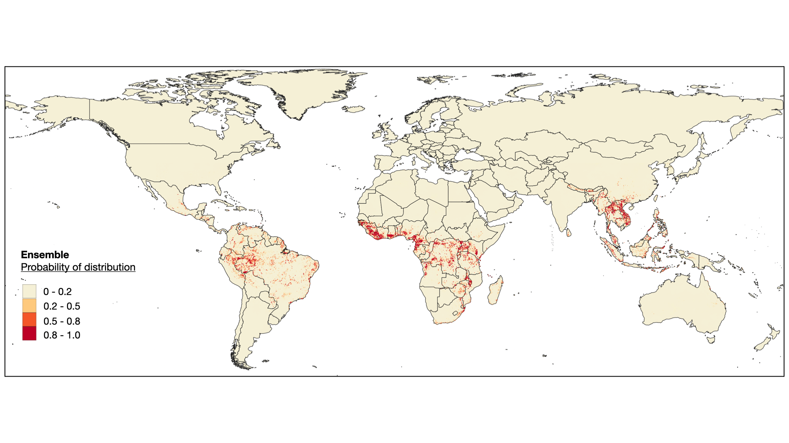

## Mapping the global distribution of Bushmeat-related activities 
##
Soushieta Jagadesh <soushieta.jagadesh@ethz.ch>
##
June 2022
##

With increasing frequency of zoonotic disease emergence, the development of sustainable and effective surveillance frameworks at high-risk areas of human-animal interactions is under international scrutiny. Human populations that hunt, prepare and sell bushmeat (bushmeat-related activities) are at increased risk of spillover of the pathogens between the wild animals and humans and have been the source of zoonotic epidemics such as Monkeypox and SARS. We proposed to map the distribution of bushmeat-related activities based on its environmental drivers and demographic factors using occurrence data extracted from literature review. The resulting map, an ensemble of three geospatial models, was found coherent with the occurrence data and had a high maxTSS of 0.94, thus able to predict both presence of bushmeat-related activities with reasonable accurately. Countries in West and Central Africa were found to have the highest proportion of area at risk for bushmeat-related activities. Mammal richness, deforestation, and climatic variables (minimum temperature and precipitation) were found to have the most impact on the model distributions. We identified 100 sites that would benefit from additional surveillance, with highest number of additional surveys needed in Indonesia (15%) and Brazil (14%). Overall, we produced a robust prediction of the geographical distribution of bushmeat-related activities that would benefit surveillance efforts in sustainable and efficient monitoring of spillovers and anticipate zoonotic disease emergence.

